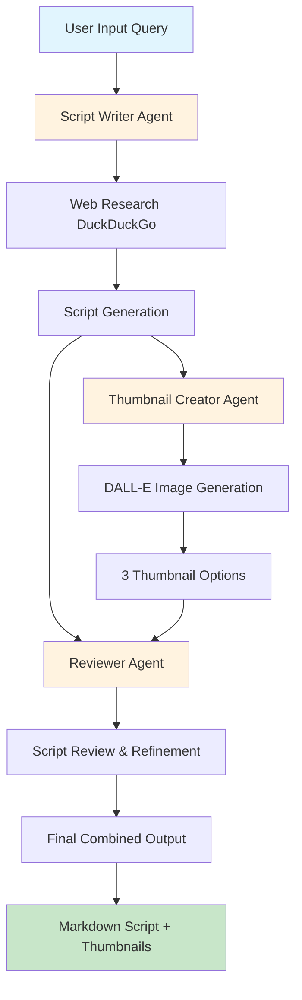
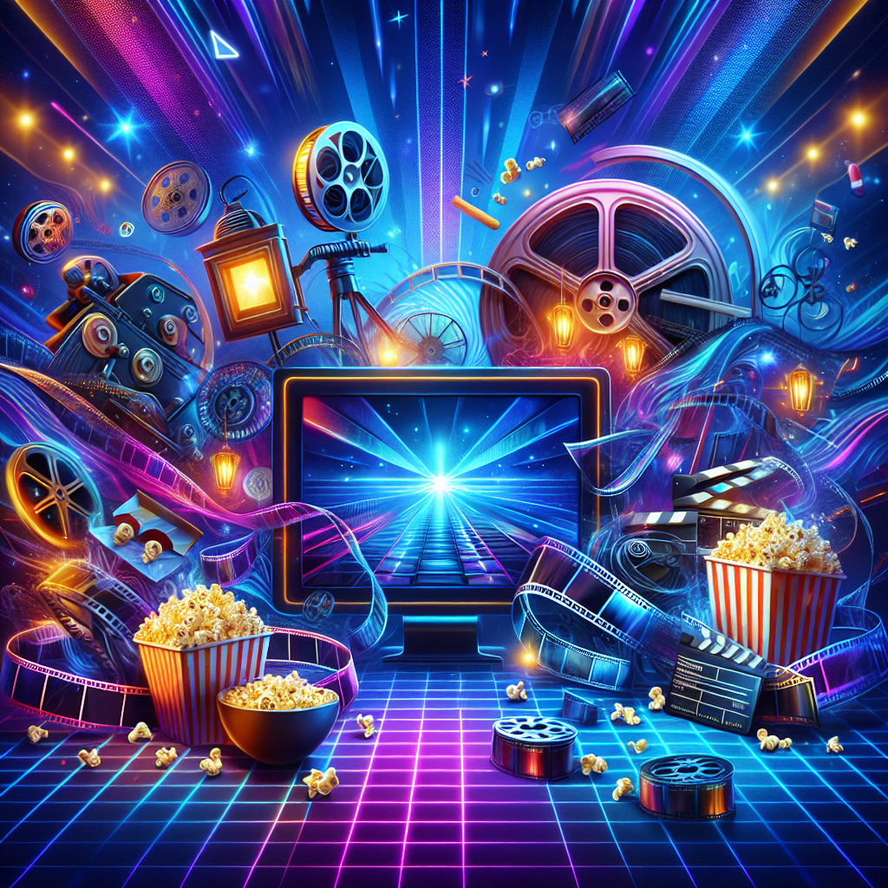

# StudioAgent-Cinema

An automated system for generating cinema video scripts and thumbnails using AI agents. This project leverages CrewAI to coordinate multiple specialized agents that research, write, and create visual content for cinema-themed YouTube videos.

## Project Overview

StudioAgent-Cinema is a multi-agent AI system that automates the creation of video scripts and thumbnails for cinema content. The system uses three specialized agents working in coordination: a Script Writer who researches and creates compelling scripts, a Thumbnail Creator who generates visually appealing thumbnails using DALL-E, and a Reviewer who ensures quality and combines all elements into a final deliverable.

## Features

- **Automated Script Generation**: Researches cinema topics and creates structured scripts with introduction, main content, and conclusion
- **AI-Powered Thumbnail Creation**: Generates three unique thumbnail options using DALL-E based on script content
- **Quality Review Process**: Automated review and refinement of scripts and visual content
- **Hierarchical Agent Coordination**: Uses CrewAI's hierarchical process for efficient agent management
- **Web Research Integration**: DuckDuckGo search integration for up-to-date cinema information

## System Architecture



## Installation

### Prerequisites

- Python 3.12
- OpenAI API key

### Setup

1. Clone the repository:
```bash
git clone <repository-url>
cd StudioAgent-Cinema
```

2. Set up the virtual environment:
```bash
make setup
```

3. Activate the environment and install dependencies:
```bash
make activate
```

4. Set up your environment variables:
Create a `.env` file in the project root with:
```
OPENAI_API_KEY=your_openai_api_key_here
```

## Usage

### Basic Usage

Run the system with a cinema-related topic:

```python
from crewai import Crew, Process

# The system is ready to use with the predefined crew
result = crew.kickoff(inputs={"query": "Best movies of 2024"})
```

### Available Commands

- `make setup` - Initialize the development environment
- `make activate` - Activate virtual environment and install dependencies

## Agent Architecture

### Script Writer Agent
- **Role**: Researches and writes cinema scripts
- **Tools**: DuckDuckGo search
- **Output**: Structured markdown script with introduction, main content, and conclusion

### Thumbnail Creator Agent
- **Role**: Creates visually appealing thumbnails
- **Tools**: DALL-E image generation
- **Output**: Three unique 1920x1080 thumbnail images with catchy text

### Reviewer Agent
- **Role**: Quality control and content integration
- **Process**: Reviews script, requests improvements if needed, combines final script with thumbnails
- **Output**: Complete markdown document with script and embedded thumbnails

## Output Format

The system generates a comprehensive markdown document containing:
- Well-structured cinema script
- Three thumbnail options embedded as images
- Professional formatting ready for content creation

## Technologies Used

- **Python 3.12** - Main programming language
- **CrewAI** - Multi-agent AI orchestration framework
- **LangChain** - Framework for LLM-based application development
- **OpenAI API** - GPT model for text generation and DALL-E for images
- **DuckDuckGo Search** - Web search tool for up-to-date information
- **Jupyter Notebook** - Interactive development environment
- **Make** - Task automation and environment configuration
- **Python-dotenv** - Environment variable management

## Dependencies

- `crewai` - Multi-agent orchestration framework
- `crewai-tools` - AI tools integration
- `langchain-openai` - OpenAI LLM integration
- `duckduckgo-search` - Web search functionality
- `langchain-community` - Community tools
- `python-dotenv` - Environment variable management

## Examples

### Sample Input
```python
inputs = {"query": "Oscar nominated films 2024"}
```

### Expected Output
A comprehensive markdown document including:
- Detailed script about Oscar nominated films
- Three professionally designed thumbnails
- Coherent narrative structure suitable for video production

## Sample Generated Thumbnails

Below are examples of thumbnails generated by the AI agents for cinema-related content:

# Review of the Best Movies of 2024

## Joy

**Storyline:**
"Joy" is a heartwarming drama that follows the life of a young woman overcoming personal struggles to find her true passion and happiness. Set against the vibrant backdrop of a bustling city, the film explores themes of resilience, self-discovery, and the power of hope. As Joy navigates challenges in both her professional and personal life, she learns valuable lessons about trust, love, and the importance of pursuing one's dreams no matter the obstacles.

**Thumbnail Description:**

A vibrant, uplifting image featuring the protagonist Joy standing confidently amidst a bustling city skyline at sunset. Warm hues of orange and pink cast a hopeful glow, emphasizing her journey towards self-empowerment. The text overlay reads, "Joy – A Story of Hope and Resilience."

---

## Ainda Estou Aqui

**Storyline:**
"Ainda Estou Aqui" is a compelling narrative centered around a middle-aged man who grapples with identity and belonging after a life-changing event. The film delves deep into themes of memory, reconciliation, and personal growth as the protagonist reconnects with his roots and those he left behind. Set in a picturesque coastal town, the story intertwines moments of introspection with striking visuals that highlight the beauty of rediscovery and second chances.

**Thumbnail Description:**

A contemplative, serene image displaying the main character gazing out towards the ocean at dusk, with soft blues and purples dominating the palette. The mood reflects introspection and peace. The text overlay says, "Ainda Estou Aqui – Embracing the Past, Finding the Future."

## Final Composition

**Thumbnail Description:**

A professionally composed thumbnail combining cinematic elements with engaging visual hierarchy, optimized for YouTube's platform and designed to maximize click-through rates.